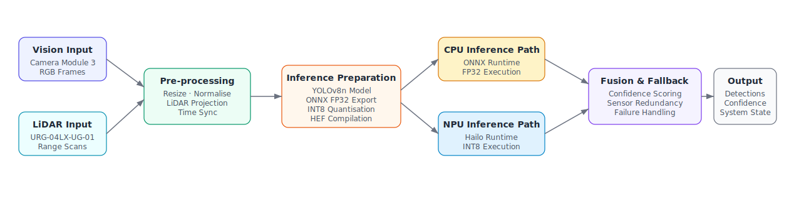
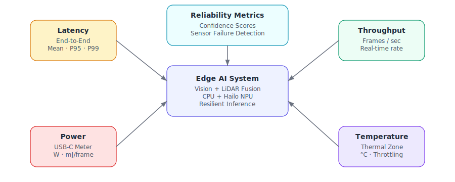

# resilient-edge-ai-fusion — Technical Project Description

## Project Overview

`resilient-edge-ai-fusion` is a failure-aware multimodal edge AI framework for evaluating resilient perception under degraded sensing conditions using Vision-LiDAR fusion on embedded hardware.

The project is based on the initial proposal in [AI_IoT_Edge_ProjectProposal.pdf](images/AI_IoT_Edge_ProjectProposal.pdf). The diagrams in `images/` are reference figures that guide implementation structure; the codebase should remain the source of executable behaviour.

The target platform is:

- Raspberry Pi 5
- Hailo AI HAT+ with Hailo-8L accelerator
- Raspberry Pi Camera Module 3
- Hokuyo URG-04LX-UG-01 LiDAR

The system combines semantic perception from camera frames, geometric spatial awareness from LiDAR scans, confidence-based fusion, adaptive fallback, and hardware-aware benchmarking. The goal is to maintain useful perception when one modality degrades, while measuring the latency, throughput, energy, and robustness trade-offs between CPU and NPU execution.

## Research Objective

The central objective is to determine whether intelligent Vision-LiDAR fusion improves resilience, operational continuity, and perceptual robustness in edge AI systems under degraded sensing conditions.

The project evaluates:

- how object detection performance changes under controlled camera and LiDAR degradation
- how adaptive fusion mitigates partial sensor failure
- how fallback strategies preserve operational awareness
- how CPU and Hailo NPU inference paths compare for latency, throughput, and energy
- whether the system remains viable within embedded compute, memory, power, and thermal constraints

## Reference Architecture



The architecture follows a structured data flow:

```text
Sensor acquisition
-> Pre-processing and synchronisation
-> Model preparation for CPU/NPU execution
-> Inference
-> Post-processing and fusion
-> Fallback decision logic
-> Metrics logging and robustness evaluation
```

The CPU and NPU paths must be defined before inference:

- **CPU baseline path:** YOLOv8n is exported to ONNX and executed with ONNX Runtime using FP32 precision.
- **NPU accelerated path:** YOLOv8n is quantised to INT8 using the Hailo toolchain and compiled into Hailo Executable Format (HEF) for execution with the Hailo runtime.

This distinction is important because the two paths are not interchangeable runtime choices over the same artefact. They require different model formats, precision targets, execution providers, and deployment checks.

## System Components

### 1. Vision Perception Pipeline

**Purpose:** provide semantic scene understanding through object detection.

| Component | Function |
| --- | --- |
| Raspberry Pi Camera Module 3 | Captures RGB frames |
| YOLOv8n | Performs object detection |
| OpenCV | Handles image loading, resizing, colour conversion, and frame operations |
| Ultralytics / ONNX Runtime / Hailo Runtime | Executes model inference depending on deployment path |

**Outputs**

- bounding boxes
- class labels
- confidence scores
- annotated frames where needed for debugging and evaluation

### 2. LiDAR Perception Pipeline

**Purpose:** provide geometric spatial awareness that is less dependent on ambient lighting.

| Component | Function |
| --- | --- |
| Hokuyo URG-04LX-UG-01 | Captures 2D range scans |
| USB serial interface | Provides LiDAR data acquisition |
| `polar_to_cartesian()` | Converts polar range scans into Cartesian points |
| LiDAR projection utilities | Align geometric measurements with the camera frame where calibration data is available |

**Outputs**

- raw range measurements
- Cartesian point projections
- geometric occupancy or distance cues for fusion

### 3. Pre-processing and Synchronisation

**Purpose:** prepare sensor samples so inference and fusion operate on aligned multimodal data.

| Step | Description |
| --- | --- |
| Image resize | Resize camera frames to the model input size, typically 640 x 640 |
| Normalisation | Convert frame data into the expected model input format |
| LiDAR projection | Convert range scans into spatial points and project them toward the image plane |
| Timestamping | Record acquisition time for camera and LiDAR samples |
| Temporal matching | Pair the nearest valid LiDAR scan with each frame |

**Implementation expectation:** pre-processing should produce a fused sample object or equivalent structure containing the image tensor/frame, LiDAR projection, timestamps, and basic validity flags.

### 4. Model Preparation and Deployment Paths

**Purpose:** make the inference targets explicit before runtime execution.

| Path | Model artefact | Precision | Runtime | Role |
| --- | --- | --- | --- | --- |
| CPU baseline | ONNX | FP32 | ONNX Runtime | Accuracy and latency baseline |
| NPU accelerated | HEF | INT8 | Hailo Runtime | Hardware-accelerated embedded inference |

The CPU path should be used to validate model behaviour independently of the accelerator. The NPU path should be used to measure acceleration benefits and deployment constraints after quantisation and compilation.

Required preparation steps:

- export YOLOv8n to ONNX for CPU inference
- validate ONNX output shape and confidence behaviour
- quantise the model to INT8 for Hailo deployment
- compile the quantised model to HEF
- validate Hailo runtime execution on the Raspberry Pi 5 + Hailo AI HAT+
- keep CPU and NPU metrics separate in logs

### 5. Inference and Post-processing

**Purpose:** execute object detection and convert model outputs into usable detections.

Post-processing includes:

- bounding box decoding
- confidence filtering
- non-maximum suppression
- class label mapping
- latency measurement around the inference boundary

The implementation should record whether each result came from CPU or NPU execution so later evaluation can compare performance, energy, and robustness without mixing paths.

### 6. Fusion Engine and Fallback Logic

**Purpose:** combine semantic confidence from the vision model with geometric evidence from LiDAR, then adjust trust when one modality becomes unreliable.

| Component | Function |
| --- | --- |
| Confidence fusion | Combines detection confidence with LiDAR-derived spatial support |
| Modality weighting | Dynamically adjusts trust in camera or LiDAR evidence |
| Failure detection | Flags degraded input such as low-light frames, occlusion, noise, or LiDAR dropout |
| Adaptive fallback | Continues operation with reduced confidence when one modality is unreliable |

**Outputs**

- fused confidence scores
- selected detections
- modality health state
- fallback state
- system-level decision state

### 7. Robustness Evaluation Framework



**Purpose:** quantify resilience under degraded sensing conditions and compare CPU/NPU deployment behaviour.

| Degradation | Purpose |
| --- | --- |
| Low-light | Simulates illumination failure |
| Motion blur | Simulates camera movement or fast scene motion |
| Gaussian noise | Simulates sensor corruption |
| Occlusion | Simulates partial visual obstruction |
| LiDAR dropout | Simulates missing or unreliable range scans |
| Temporal desynchronisation | Simulates camera-LiDAR timing mismatch |

The evaluation should include clean baseline runs and degraded runs. Each run should identify the active degradation, severity level, inference path, and fallback state.

## Metrics

The project should record both performance and robustness metrics.

| Metric | Description |
| --- | --- |
| Latency per frame | End-to-end and inference-only timing |
| Throughput | Frames per second |
| Energy per inference | `E = P x t`, using measured power and inference time |
| CPU utilisation | Host processing load |
| Memory usage | Runtime footprint |
| Temperature | Thermal behaviour during sustained workloads |
| Detection confidence | Model-level prediction confidence |
| Fusion confidence | Confidence after Vision-LiDAR fusion |
| Robustness score | Performance retained under degradation |
| Recovery behaviour | Ability to return to baseline after degradation ends |

Metric logs should distinguish:

- CPU FP32 ONNX inference
- NPU INT8 Hailo inference
- clean sensor operation
- degraded camera operation
- degraded LiDAR operation
- combined or synchronisation-related failures

## Repository Mapping

| Area | Current location |
| --- | --- |
| Vision capture and model tests | `scripts/camera_capture.py`, `scripts/test_yolo.py`, `scripts/test_onnx.py` |
| LiDAR capture and projection | `scripts/lidar_capture.py`, `preprocessing/lidar_projection.py`, `fusion/lidar.py` |
| Synchronisation | `fusion/synchronise.py`, `preprocessing/synchronisation/` |
| Fusion logic | `fusion/confidence_fusion.py`, `fusion/pipeline.py` |
| Robustness degradations | `preprocessing/degradations/` |
| Metrics | `metrics/`, `scripts/logger.py` |
| Configuration | `configs/` |
| Tests | `tests/` |
| Reference figures and proposal | `images/` |

## Implementation Priorities

1. Validate the offline pipeline with known camera frames and LiDAR logs.
2. Keep CPU and NPU model preparation explicit and separately measurable.
3. Establish clean baseline metrics before applying degradations.
4. Add one degradation type at a time and verify the fusion response.
5. Log modality health, fallback state, inference path, latency, and confidence for every run.
6. Compare robustness and efficiency across CPU baseline and Hailo-accelerated execution.

## Expected Outcome

The expected outcome is a practical framework for resilient AIoT perception that demonstrates how Vision-LiDAR fusion and adaptive fallback can maintain useful detection behaviour under partial sensor failure. The project should also quantify whether Hailo NPU acceleration improves real-time viability and energy efficiency compared with the CPU baseline on Raspberry Pi 5.
